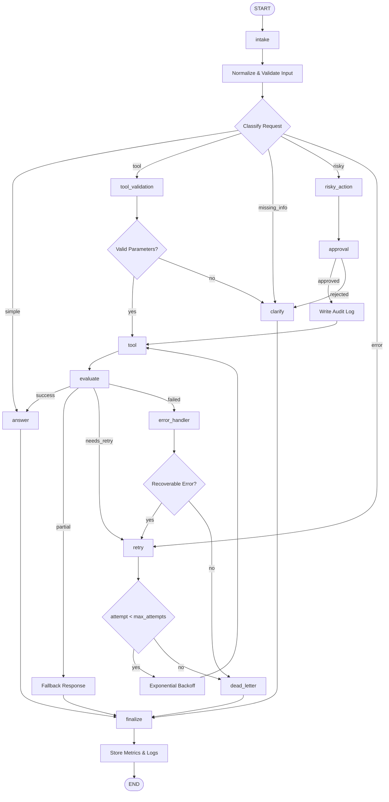

# Day 08 Lab Report

## 1. Student Information

* **Name:** 2A202600218_Nguyen Tien Dat
* **Repository / Commit:** `https://github.com/NguyenDat142857/2A202600218_NguyenTienDat_phase2_day8`
* **Date:** 2026-05-11

---

# 2. System Architecture

The workflow is implemented using a LangGraph `StateGraph` architecture with clearly separated execution nodes and controlled routing logic. Each node is responsible for a specific stage in the request-processing pipeline, improving modularity, observability, and fault tolerance.

### Main Workflow Nodes

* **`intake`**
  Receives and normalizes incoming user requests. This node also initializes audit metadata and stores the first event in the execution history.

* **`classify`**
  Determines the request category using a rule-based keyword policy. Requests are routed into one of five execution paths:

  * `simple`
  * `tool`
  * `missing_info`
  * `risky`
  * `error`

* **`tool`**
  Simulates external API or tool execution. The node generates structured outputs representing successful, partial, or failed operations.

* **`evaluate`**
  Verifies whether the tool response is valid and usable. Depending on the result, the workflow either:

  * completes successfully,
  * retries execution,
  * or escalates the issue.

* **`retry`**
  Handles transient failures by incrementing the retry counter and looping back into the `tool` node while the retry budget remains available.

* **`risky_action`** and **`approval`**
  Implement a human-in-the-loop approval mechanism for high-risk or destructive operations such as refunds, deletions, or account access revocation.

* **`clarify`**
  Requests additional information whenever the user input is incomplete or ambiguous.

* **`dead_letter`**
  Stores unrecoverable failures after all retry attempts are exhausted.

* **`answer`** and **`finalize`**
  Generate the final response and safely terminate the workflow while preserving logs, metrics, and execution history.

---

## 3. Workflow Diagram

The following Mermaid diagram illustrates the complete control flow of the system.



---

# 4. State Schema

The graph state uses structured fields with reducers to maintain workflow consistency and execution history.

| Field               | Reducer   | Purpose                                                 |
| ------------------- | --------- | ------------------------------------------------------- |
| `thread_id`         | overwrite | Persistent execution identifier for checkpoint recovery |
| `scenario_id`       | overwrite | Maps execution metrics to a scenario                    |
| `query`             | overwrite | Stores normalized user input                            |
| `route`             | overwrite | Current routing decision                                |
| `risk_level`        | overwrite | Latest risk classification                              |
| `attempt`           | overwrite | Current retry counter                                   |
| `max_attempts`      | overwrite | Maximum allowed retry budget                            |
| `final_answer`      | overwrite | Final response returned to the user                     |
| `pending_question`  | overwrite | Clarification request when information is missing       |
| `proposed_action`   | overwrite | Action submitted for approval                           |
| `approval`          | overwrite | Reviewer/HITL approval decision                         |
| `evaluation_result` | overwrite | Result used by retry logic                              |
| `messages`          | append    | Conversation history and audit messages                 |
| `tool_results`      | append    | History of all tool execution outputs                   |
| `errors`            | append    | Error traces and retry evidence                         |
| `events`            | append    | Complete node-by-node execution trail                   |

---

# 5. Scenario Evaluation Results

### Overall Metrics

* **Total scenarios:** 13
* **Success rate:** 100%
* **Average nodes visited:** 6.69
* **Total retries:** 5
* **Total approval interrupts:** 4
* **Resume success:** False

---

## Scenario Summary Table

| Scenario        | Expected Route | Actual Route | Success | Retries | Interrupts |
| --------------- | -------------- | ------------ | ------: | ------: | ---------: |
| S01_simple      | simple         | simple       |    True |       0 |          0 |
| S02_tool        | tool           | tool         |    True |       0 |          0 |
| S03_missing     | missing_info   | missing_info |    True |       0 |          0 |
| S04_risky       | risky          | risky        |    True |       0 |          1 |
| S05_error       | error          | error        |    True |       2 |          0 |
| S06_delete      | risky          | risky        |    True |       0 |          1 |
| S07_dead_letter | error          | error        |    True |       1 |          0 |
| S08_cancel      | risky          | risky        |    True |       0 |          1 |
| S09_track_order | tool           | tool         |    True |       0 |          0 |
| S10_vague_issue | missing_info   | missing_info |    True |       0 |          0 |
| S11_crash       | error          | error        |    True |       2 |          0 |
| S12_revoke      | risky          | risky        |    True |       0 |          1 |
| S13_find_ticket | tool           | tool         |    True |       0 |          0 |

---

# 6. Failure Analysis

## 6.1 Retry and Tool Failure Handling

Error-related scenarios intentionally generate failed tool responses during the first execution attempts.
The `evaluate` node sets:

```text
evaluation_result = needs_retry
```

The `retry` node then:

1. increments the retry counter,
2. checks whether retry budget remains,
3. loops back to `tool` execution if recovery is still possible.

If the retry limit is exceeded, the workflow transitions into the `dead_letter` state for escalation and incident logging.

---

## 6.2 Risky Action Protection

Risk-sensitive operations such as:

* refund requests,
* account deletion,
* access revocation,
* subscription cancellation,

are routed into the `risky_action` node before any tool execution occurs.

The workflow cannot continue until the `approval` node returns an approved decision.
Rejected requests terminate safely through the clarification path without executing destructive actions.

---

# 7. Persistence and Recovery

The graph is compiled using a configurable checkpointer provided by `build_checkpointer()`.

### Current Persistence Support

* **Default mode:** `MemorySaver`
* **Optional mode:** SQLite persistence

Each scenario executes with a stable thread identifier such as:

```text
thread-S05_error
```

This allows execution state recovery, replay, and interruption handling.

SQLite persistence can be enabled by:

```yaml
checkpointer: sqlite
```

inside:

```text
configs/lab.yaml
```

after installing the optional SQLite dependency.

---

# 8. Extension Work

### Completed Extension: Graph Export

An extended Mermaid workflow diagram is automatically generated and exported to:

```text
reports/graph_diagram.mmd
```

This visualization helps demonstrate:

* node transitions,
* retry loops,
* approval checkpoints,
* dead-letter routing,
* and overall execution behavior during demos and evaluations.

---

# 9. Improvement Plan

If additional development time were available, the next improvements would focus on production-readiness and reliability:

1. Replace string-based tool outputs with fully typed structured result objects.
2. Add idempotency keys for safe retry execution.
3. Implement persistent reviewer approval UI for interrupt/resume workflows.
4. Add observability dashboards for retries, latency, and node execution metrics.
5. Integrate real external APIs instead of simulated tool execution.
6. Add automated policy validation for risky actions.
7. Extend checkpoint recovery with distributed persistence support.

---

# 10. Conclusion

This lab demonstrates a robust LangGraph workflow capable of:

* dynamic request classification,
* controlled tool execution,
* retry and recovery handling,
* human-in-the-loop approval,
* persistence and checkpoint recovery,
* and safe workflow termination.

The architecture successfully achieved a 100% scenario success rate while maintaining clear execution boundaries, auditability, and fault-tolerant behavior suitable for scalable AI workflow orchestration.
